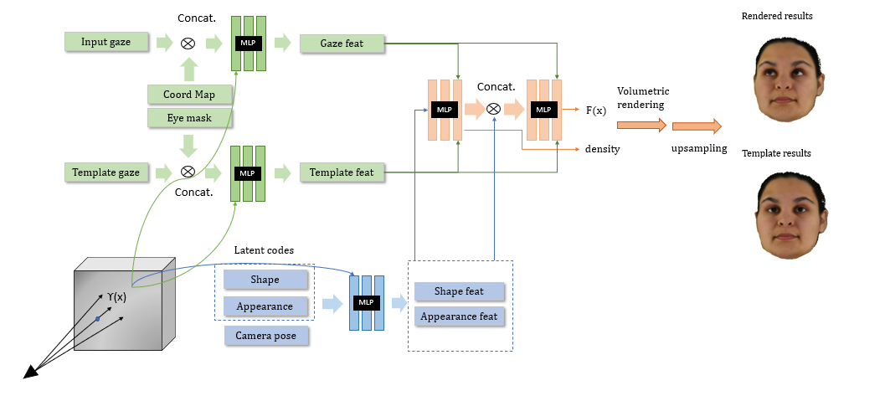

# NeRF-based method for gaze redirection with sparse inputs

This repository contains a pytorch implementation of "NeRF-based method for gaze redirection with sparse inputs".

 
This code has been tested on ubuntu 20.04/18.04 and contains the following parts:


Main Contribution


1. **A training framework to train a gaze redirection network to synthesize unseen eye-gaze direction in novel view**.
2. **A fitting framework** for obtaining the latent code embedding of a single image.

## Requirements

Setup Environment

```bash
conda env create -f environment.yaml
conda activate gazenerf
```

* [Pytorch](https://pytorch.org/get-started/locally/)

  Please refer to [pytorch](https://pytorch.org/get-started/locally/) for details.


* [Pytorch3d](https://github.com/facebookresearch/pytorch3d)

  It is recommended to install pytorch3d from a local clone.

  ```bash
  
  git clone https://github.com/facebookresearch/pytorch3d.git
  cd pytorch3d && pip install -e . && cd ..
  ```

<!--
conda install -c bottler nvidiacub
conda install -c fvcore -c iopath -c conda-forge fvcore iopath -->

## Data Preprocesing

We follow a simiar data prerpocessing pipeline as headnerf (https://github.com/CrisHY1995/headnerf), which extracts facial landmarks and binary mask for human face. In our case, we additionally need to extrace periocular eye mask for human face.

Download [ConfigModels.zip](https://mailustceducn-my.sharepoint.com/:u:/g/personal/hymath_mail_ustc_edu_cn/EVROtiHQqNtLoAlLweyIFV0BDrLcGn_bpHnlM6tREfcQLQ?e=n0howy), [TrainedModels.zip](https://mailustceducn-my.sharepoint.com/:u:/g/personal/hymath_mail_ustc_edu_cn/EZ78EK8mylZBoGe-jCVibjEBVtoicnFvM0jpjaE56F4ihw?e=LC0SH7), and [LatentCodeSamples.zip](https://mailustceducn-my.sharepoint.com/:u:/g/personal/hymath_mail_ustc_edu_cn/EWNBh3ZVo7VFnO9uPRuDYAABbhrx8kyQa53fHv4szdgJ-A?e=bXiAfh), then unzip them to the root dir of this project.

Other links: [Google Drive](https://drive.google.com/drive/folders/1e-DWDrCB6mUcr6MnGbMX0M9YTVl2U6KO?usp=sharing), [One Drive](https://mailustceducn-my.sharepoint.com/:f:/g/personal/hymath_mail_ustc_edu_cn/Eld8rudJhVVMrgkl-OLmKjQBBZRUg_q-1O_kWizcGYpTjQ?e=xyfLfw)

The folder structure is as follows:

```
root
├── ConfigModels
│   ├── faceparsing_model.pth
│   ├── nl3dmm_dict.pkl
│   └── nl3dmm_net_dict.pth
│
├── TrainedModels
│   ├── model_Reso32.pth
│   ├── model_Reso32HR.pth
│   └── model_Reso64.pth
│
└── LatentCodeSamples
├── model_Reso32
│   ├── S001_E01_I01_P02.pth
│   └── ...
├── model_Reso32HR
│   ├── S001_E01_I01_P02.pth
│   └── ...
└── model_Reso64
├── S001_E01_I01_P02.pth
└── ...
```


To generate head mask, land marks and 3DMM model, you can run

```javascript
python DataProcess/Gen_mask_lm_3DMM.py --img_dir /path/to/image_dir
                                       --save_dir XGaze_data/hdf_dataset/..
                                       --sb 0
                                       --se 10
```

Args:

* **img_dir** is the path to the original XGaze Dataset
* **save_dir** is the path to save the processed hdf file which contains mask, landmarks and 3DMM model
* **sb** is the first subject to consider
* **se** is the last subject to considerThe training framework

## The training framework

This part provides a framework to train a gaze direction conditioned neural radiance field on ETH-XGaze dataset. We use yaml file in to specify our configurarion for training:

```bash
python train_headnerf.py --config_file config/train_HeadNeRF_Gaze.yml
```

You can find specific training configuration in config folder.

Similarly, you could run evalution with the following command:

```bash
python Evaluation.py --config_file_path config/full_evaluation.yml
```

Some important args in yml file:

* **loss_config** specifies the weight for each loss terms
* **init_lr, lr_patience, lr_decay_factor** specifies the learning rate change with regard to the epochs
* **model_name** choose the network structure to train, which is HeadNeRF_Gaze by default.

## The fitting framework

This part provides a framework for fitting a single image using HeadNeRF. Besides, some test images are provided in test_data/single_images dir. These images are from [FFHQ dataset](https://github.com/NVlabs/ffhq-dataset) and do not participate in building HeadNeRF's models.

#### Fitting a Single Image

```Bash
# Fitting a single image using HeadNeRF
python FittingSingleImage.py --model_path "TrainedModels/model_Reso32HR.pth" \
                             --img "test_data/single_images/img_000037.png" \
                             --mask "test_data/single_images/img_000037_mask.png" \
                             --para_3dmm "test_data/single_images/img_000037_nl3dmm.pkl" \
                             --save_root "test_data/fitting_res" \
                             --target_embedding "LatentCodeSamples/*/S025_E14_I01_P02.pth"
```

Args:

* **para_3dmm** is the 3DMM parameter of the input image and is provided in advance to initialize the latent codes of the corresponding image.
* **target_embedding** is a head's latent code embedding in HeadNeRF and is an optional input. If it is provided, we will perform linear interpolation on the fitting latent code embedding and the target latent code embedding, and the corresponding head images are generated using HeadNeRF.
* **save_root** is the directory where the following results are saved.

Results:

* The image that merges the input image and the fitting result.
* The dynamic image generated by continuously changing the rendering pose of the fitting result.
* The dynamic image generated by performing linear interpolation on the fitting latent code embedding and the target latent code embedding.
* The latent codes (.pth file) of the fitting result.


